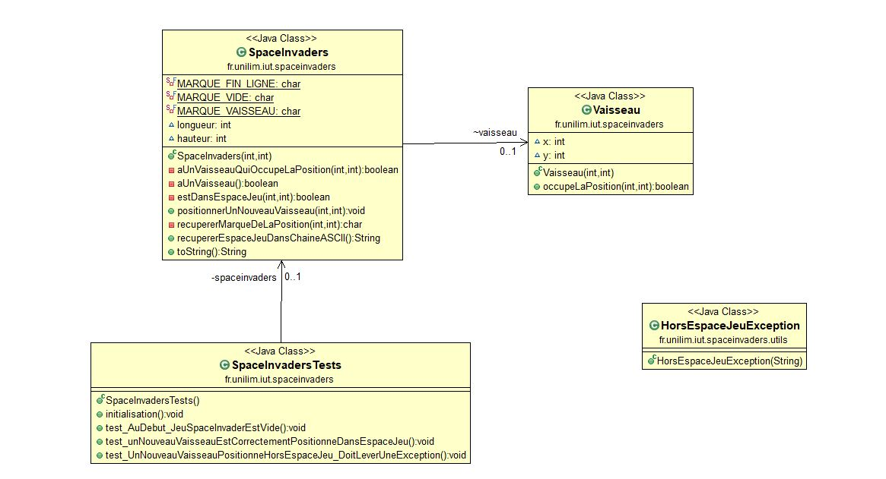

# spaceinvaders

## Menu
* [Semaine 1](#semaine1)
* [Semaine 2]()
* [Glossaire]()

## Semaine 1 : du 30 mars au 5 avril 

Lors de cette semaine j'ai créer les bases pour ce tp. C'est à dire ce github ainsi que les premices du programme space invaders. Plus précisement j'ai commencé la *fonctionnalité n°1 : Déplacer le vaisseau dans l'espace de jeu* en faisant le *sprint 1 : Créer un espace de jeu*.

## Semaine 2 : du 6 au 12 avril

Durant le tp de cette semaine j'ai continué de travailler sur la *fonctionnalité n°1 : Déplacer le vaisseau dans l'espace de jeu* en faisant le *sprint 2 : positionner un nouveau vaisseau dans l'espace de jeu*. Grace à ça nous obtenons le diagramme de classe ainsi que le nuage de mots suivants : 

