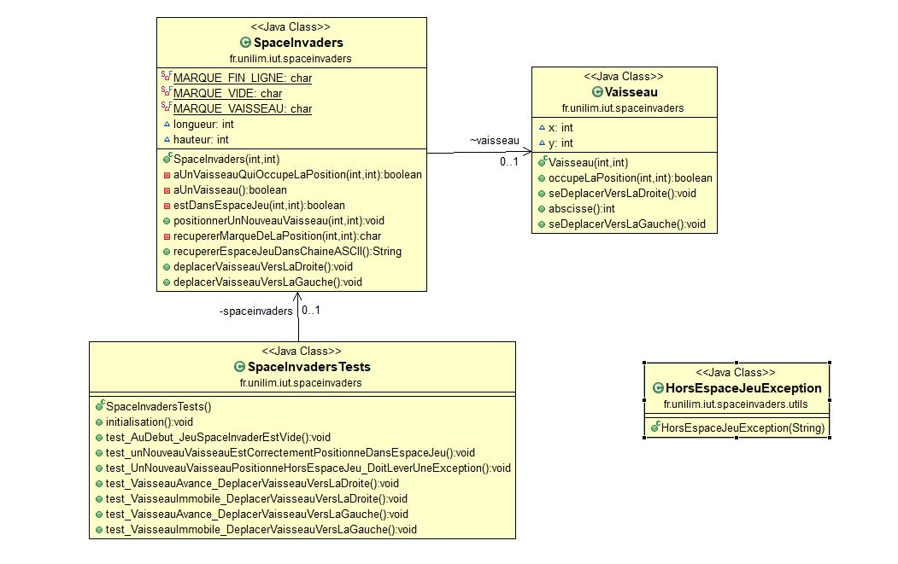

# spaceinvaders

Space Invaders est un shoot them up fixe en deux dimensions. Le joueur contrôle un canon laser qu'il peut déplacer horizontalement, au bas de l'écran.

## Menu
* [Semaine 1](#semaine1)
* [Semaine 2](#semaine2)
* [Semaine 3](#semaine3)
* [Glossaire](#glossaire)

## Semaine 1 : du 30 mars au 5 avril 

Lors de cette semaine j'ai créer les bases pour ce tp. C'est à dire ce github ainsi que les premices du programme space invaders. Plus précisement j'ai commencé la *fonctionnalité n°1 : Déplacer le vaisseau dans l'espace de jeu* en faisant le *storie 1 : Créer un espace de jeu*.

---------------------------------

## Semaine 2 : du 6 au 12 avril 

Durant le tp de cette semaine j'ai continué de travailler sur la *fonctionnalité n°1 : Déplacer le vaisseau dans l'espace de jeu* en faisant la *storie 2 : positionner un nouveau vaisseau dans l'espace de jeu*. Grace à ça nous obtenons le diagramme de classe ainsi que le nuage de mots suivants : 

### Diagramme de classe Sprint 2 :

### Nuage de mots Sprint 2 :

-----------------------

## Semaine 3 : du 13 au 19 avril 
Pendant cette sceance de tp j'ai terminé la *fonctionnalité n°1 : Déplacer le vaisseau dans l'espace de jeu* en réalisant la *storie 3 : Déplacer le vaisseau vers la droite dans l'espace de jeu* et la *storie 4 : Déplacer le vaisseau vers la gauche dans l'espace de jeu*.
Suite à cela je possède le diagramme de classe et nuage de mots suivants : 

### Diagramme de classe Fonctionnalité 1 finie :

### Nuage de mots Sprint 2 :

-------------------------

## Glossaire 

* **Vaisseau :** véhicule commandé par le joueur, pouvant se déplacer de droite à gauche et ayant la possibilité de lancer des missiles destinés à détruire le(s) envahisseurs.

* **Envahisseur :** ennemi qui apparaît à l'écran, se déplace automatiquement et qui doit être détruit par un missile lancé depuis le vaisseau du joueur.

* **Missile :** projectile envoyé à la verticale par le vaisseau vers l'envahisseur dans le but de le détruire.
